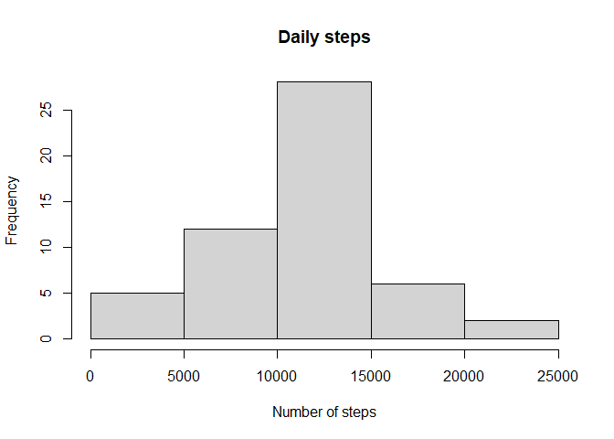
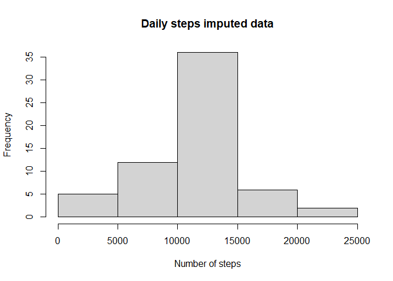

## Loading and preprocessing the data


```r
unzip("activity.zip")
data<-read.csv("activity.csv", sep = ",", header = TRUE)
names(data)
```

```
## [1] "steps"    "date"     "interval"
```

```r
dim(data)
```

```
## [1] 17568     3
```

```r
data$date <- as.Date(data$date)
summary(data)
```

```
##      steps             date               interval     
##  Min.   :  0.00   Min.   :2012-10-01   Min.   :   0.0  
##  1st Qu.:  0.00   1st Qu.:2012-10-16   1st Qu.: 588.8  
##  Median :  0.00   Median :2012-10-31   Median :1177.5  
##  Mean   : 37.38   Mean   :2012-10-31   Mean   :1177.5  
##  3rd Qu.: 12.00   3rd Qu.:2012-11-15   3rd Qu.:1766.2  
##  Max.   :806.00   Max.   :2012-11-30   Max.   :2355.0  
##  NA's   :2304
```

## What is mean total number of steps taken per day?


```r
##Make a histogram of the total number of steps taken each day
library(plyr)
data_NAs <- ddply(data,"date",summarize,steps=sum(steps))
hist(data_NAs$steps, main = "Daily steps", xlab = "Number of steps")
```

<!-- -->

```r
##Calculate and report the mean and median total number of steps taken per day
mean(data_NAs$steps, na.rm = TRUE)
```

```
## [1] 10766.19
```

```r
median(data_NAs$steps, na.rm = TRUE)
```

```
## [1] 10765
```

## What is the average daily activity pattern?

```r
##Make a time series plot (i.e. type = "l") of the 5-minute interval (x-axis) and the average number of steps taken, averaged across all days (y-axis)
int<- ddply(data,"interval",summarize,steps=mean(steps,na.rm = TRUE))
plot(int, type="l", main="Average number of steps per interval in two months")
```

<!-- -->

```r
##Which 5-minute interval, on average across all the days in the dataset, contains the maximum number of steps?
max(int$steps, na.rm = TRUE)  ##206.1698
```

```
## [1] 206.1698
```

```r
int[which.max(int$steps),]$interval   ##835
```

```
## [1] 835
```

## Imputing missing values

```r
##Calculate and report the total number of missing values in the dataset (i.e. the total number of rows with NAs)
summary(data$steps)
```

```
##    Min. 1st Qu.  Median    Mean 3rd Qu.    Max.    NA's 
##    0.00    0.00    0.00   37.38   12.00  806.00    2304
```

```r
sum(is.na(data))
```

```
## [1] 2304
```

```r
##Devise a strategy for filling in all of the missing values in the dataset.

        ##Strategy: Impute NAs with the mean value of each interval:

int_mean<- function (interval){
        int[int$interval==interval,]$steps}

##Create a new dataset that is equal to the original dataset but with the missing data filled in.
data_noNAs<-read.csv("activity.csv", sep = ",", header = TRUE)
for(i in 1:nrow(data_noNAs)){
    if(is.na(data_noNAs[i,]$steps)){
        data_noNAs[i,]$steps <- int_mean(data_noNAs[i,]$interval)
    }
}

##Make a histogram of the total number of steps taken each day and Calculate and report the mean and median total number of steps taken per day. Do these values differ from the estimates from the first part of the assignment? What is the impact of imputing missing data on the estimates of the total daily number of steps?
sum_stepsnoNAs<- ddply(data_noNAs,"date",summarize,steps=sum(steps))
hist(sum_stepsnoNAs$steps, main = "Daily steps imputed data", xlab = "Number of steps")
```

<!-- -->

```r
##Average of steps per day in data original and data imputed
summary(data_NAs$steps, na.rm=TRUE)
```

```
##    Min. 1st Qu.  Median    Mean 3rd Qu.    Max.    NA's 
##      41    8841   10765   10766   13294   21194       8
```

```r
summary(sum_stepsnoNAs$steps)
```

```
##    Min. 1st Qu.  Median    Mean 3rd Qu.    Max. 
##      41    9819   10766   10766   12811   21194
```

```r
##Mean values do not change with values imputed. Median increased 0.01 % from the original value:
##(37.3826/37.37847)*100-100 = 0.009289364
```

## Are there differences in activity patterns between weekdays and weekends?

```r
##Create a new factor variable in the dataset with two levels -- "weekday" and "weekend" indicating whether a given date is a weekday or weekend day.
df<-data_noNAs
data_noNAs2<-df
data_noNAs2$date<- as.Date(strptime(data_noNAs2$date, format="%Y-%m-%d"))
data_noNAs2$day<-weekdays(data_noNAs2$date)
for (i in 1:nrow(data_noNAs2)) {
        if (data_noNAs2[i,]$day %in% c("Saturday", "Sunday")){
            data_noNAs2[i,]$day<-"weekend"    
        }
        else{
                data_noNAs2[i,]$day<-"weekday"
        }
}
                
   ##average by weeknm1day/weekend
meansteps_w<- ddply(data_noNAs2,.(interval, day),summarize,steps=mean(steps))

##Make a panel plot containing a time series plot (i.e. type = "l") of the 5-minute interval (x-axis) and the average number of steps taken, averaged across all weekday days or weekend days (y-axis).
library(ggplot2)
ggplot(meansteps_w,aes(x=interval,y=steps))+
        geom_line(stat="identity", size=1, color="purple")+
        facet_wrap(~day, dir="v")+
        labs(x="interval", y="average steps")+
        ggtitle("Average steps taken in a weekday/weekend")
```

<!-- -->


